# 基于springboot的图书进销存管理系统

#### 介绍

在图书行业日益繁荣的背景下，高效、准确地管理图书的进销存业务对于图书企业的运营至关重要。本基于 SpringBoot 的图书进销存管理系统旨在为图书企业提供一个全面、便捷、智能化的管理解决方案，解决传统管理方式中存在的信息分散、流程繁琐、数据不准确等问题，提高企业的运营效率和管理水平。

#### 技术栈

后端技术栈：Springboot+Mysql+Maven

前端技术栈：Vue+Html+Css+Javascript+ElementUI

开发工具：Idea+Vscode+Navicate

#### 系统功能介绍

个人中心：  
管理员可以查看个人的详细信息，包括姓名、工号、联系方式等，同时可以对这些信息进行修改和更新。  
能够设置个性化的工作界面，如常用功能的快捷入口、数据展示的格式等。  
查看系统操作的历史记录，如登录的时间、地点，执行的重要操作以及操作的结果等。  
用户管理：  
可以新增用户账号，填写用户的基本信息，如用户名、密码、所属部门等。  
对已有的用户信息进行修改，包括调整用户的权限、所属岗位等。    
对于不再需要的用户账号进行删除操作，但会保留相关的操作记录。  
为不同的用户分配具体的角色，如采购员、销售员、仓库管理员等，每个角色具有不同的系统操作权限。  
查看用户的登录情况，包括登录的时间、IP 地址等，监督用户的活动是否符合规定。  
图书类型管理：  
按照不同的标准对图书进行分类，如按照学科分类为文学、历史、科学等，或者按照读者年龄段分类为儿童读物、青少年读物、成人读物等。  
为每种图书类型设置独特的标识和属性，例如文学类图书可以标注为“虚构作品”，科学类图书标注为“学术研究”等。  
根据市场需求和业务变化，灵活地增加新的图书类型，例如随着新兴领域的发展新增“人工智能”相关的图书类型。  
对于不再流行或业务不再涉及的图书类型进行删除，但会提前检查是否有相关图书仍在库存中。  
进货订单管理：  
接收来自供应商的进货订单，订单中包含图书的名称、ISBN 码、数量、单价、预计到货时间等详细信息。  
对进货订单进行仔细的审核，检查订单的信息是否准确、完整，价格是否合理，供应商的信誉是否良好等。  
确认无误的进货订单会被标记为“已确认”，并通知供应商发货；有问题的订单会被退回给供应商进行修改。  
实时跟踪进货订单的执行情况，包括供应商的发货时间、物流信息、预计到货时间等，确保图书能够按时到达仓库。  
商品退货管理：  
处理来自客户或门店的商品退货申请，申请中需说明退货的图书名称、数量、退货原因等。  
对退货的商品进行质量检验，判断是否符合退货条件，例如是否有损坏、是否在退货期限内等。  
对于符合退货条件的商品，安排入库，并更新库存信息；不符合条件的商品与申请人沟通解决办法。  
对退货数据进行分析，找出退货率较高的图书品种或原因，为改进采购和销售策略提供依据。  
批销订单管理：  
接收来自大客户或经销商的批销订单，订单中包含图书的品种、数量、折扣要求、交货期限等。  
对批销订单进行审批，考虑库存情况、客户信用、利润空间等因素，决定是否接受订单。  
一旦订单被批准，安排发货事宜，协调仓库、物流等部门，确保按时交付。  
跟踪批销订单的执行情况，处理可能出现的延迟交货、货物损坏等问题，维护与客户的良好关系。  
图书信息管理：  
录入新图书的详细信息，包括书名、作者、出版社、出版日期、ISBN 码、定价、页数、装帧等。  
上传图书的封面图片、内容简介、目录等资料，方便用户查看和了解图书。  
及时更新图书的库存数量、在架状态（是否可销售）、销售状态（是否畅销、滞销等）等信息。  
对于已下架或不再销售的图书，将其标记为“停售”，但保留相关信息以备查询。  
客户信息管理：  
登记客户的基本信息，如姓名、联系方式、地址、单位等。  
记录客户的购买历史，包括购买的图书品种、数量、购买时间等，分析客户的购买偏好。  
评估客户的信用等级，例如根据付款及时性、购买金额等因素，为不同信用等级的客户提供不同的服务和优惠政策。  
对客户进行分类，如按照行业、地区、购买频率等进行分组，以便进行有针对性的营销活动。  
供应商管理：  
登记供应商的基本信息，如名称、联系方式、地址、营业执照等。  
评估供应商的供货能力，包括供货的及时性、图书质量、价格优势等，建立供应商的信誉档案。  
与供应商签订合同，明确双方的权利和义务，如供货价格、交货期限、质量标准、售后服务等。  
跟踪合同的执行情况，及时处理合同履行过程中的问题，如供应商的违约行为等。  
库存分析管理：  
实时监控图书的库存数量，了解每种图书的库存水平，包括安全库存、最高库存、最低库存等。  
分析库存结构，例如不同类型图书的库存占比、不同出版社图书的库存情况等。  
计算库存周转率，即库存图书在一定时期内的周转次数，评估库存管理的效率。  
生成库存预警报告，当库存低于安全库存或高于最高库存时，及时提醒管理员进行补货或调整库存。  
收入金额管理：  
统计图书销售的总收入，包括现金收入、银行转账收入、应收账款等。  
分析不同图书品种、不同销售渠道（线上、线下）的销售收入，找出盈利的主要来源。  
计算销售毛利和净利润，扣除成本（采购成本、运输成本、营销成本等）后，评估销售业务的盈利能力。  
生成详细的收入报表，包括日报表、月报表、年报表等，为财务核算和决策提供数据支持。  
应收金额管理：  
管理客户的应收账款，记录每笔应收账款的金额、账龄（欠款时间）、客户信息等。  
跟踪应收账款的回收情况，及时向客户发送催款通知，对于逾期未付的账款采取进一步的措施，如委托第三方催收。  
分析应收账款的账龄结构，评估资金回收的风险，为制定信用政策提供参考。  
生成应收报表，反映企业应收账款的总体情况和变化趋势。  
我的收藏管理：  
管理员可以将重要的订单、客户、供应商等信息添加到收藏夹中，方便快速查找和访问。  
对收藏的信息进行分类和标注，例如标注为“紧急处理”“重点关注”等，以便区分优先级。  
可以随时取消对不再重要或已经处理完毕的信息的收藏，保持收藏夹的简洁和有效。  
系统管理：  
设置系统的基本参数，如数据备份的时间间隔、数据保留的期限、用户登录的超时时间等。  
定义不同用户角色的权限，明确每个角色可以操作的功能模块和可以查看的数据范围，保障系统的安全性。  
对系统进行定期的维护和升级，修复可能存在的漏洞和故障，优化系统性能。  
管理系统的日志，包括登录日志、操作日志等，以便进行审计和问题追溯。  
（二）用户角色  
进货订单：  
用户能够在系统中填写进货订单，详细列出需要采购的图书名称、ISBN 码、数量、期望的到货日期等。  
随时查看自己提交的进货订单在系统中的处理进度，了解订单是否已被审核、是否已发货等状态。  
对已完成的进货订单进行评价，反馈供应商的服务质量、图书的质量等情况，为后续采购提供参考。  
商品退货：  
当发现图书存在质量问题或其他不符合要求的情况时，用户可以发起商品退货申请，准确说明退货的原因和数量。  
实时跟踪退货申请的审批进度，了解是否已被批准，以及退货的后续处理流程。  
查看商品退货的历史记录，包括之前退货的原因、处理结果等，以便总结经验和改进工作。  
批销订单：  
用户可以根据客户的需求下达批销订单，明确订单中图书的品种、数量、折扣要求以及交货的时间和地点等具体条件。  
及时了解批销订单的发货情况和物流信息，确保能够按时将图书交付给客户。  
管理自己下达的批销订单记录，查看订单的完成情况和业绩数据，评估工作效果。  
图书信息：  
通过关键词搜索、分类筛选等方式查找所需的图书信息，包括图书的详细介绍、作者背景、读者评价等。  
对比不同图书的价格、库存数量、销售情况等参数，为采购和销售决策提供依据。  
关注系统推荐的热门图书和新书信息，及时掌握市场动态。  
客户信息：  
查看客户的详细资料，包括基本信息、购买历史、联系方式等，以便更好地与客户沟通和服务。  
深入了解客户的需求和反馈，及时解决客户的问题，提高客户满意度。  
对客户进行分类和标记，例如标记为“潜在大客户”“优质客户”等，为精准营销提供支持。  
个人中心：  
完善个人的基本信息，如联系方式、地址等，确保信息的准确性和完整性。  
查看自己在系统中的操作权限和职责范围，明确工作任务和目标。  
接收系统发送的通知和提醒，如订单处理结果、库存预警等，及时处理相关事务。  
后台管理：  
图书类型管理：协助管理员对图书的类型进行细分和定义，提出符合实际业务需求的分类建议。  
进货订单管理：参与进货订单的初步审核和处理，如核对订单信息的准确性等。  
商品退货管理：协助处理商品退货的相关事务，如整理退货商品的清单等。  
批销订单管理：跟进批销订单的执行进度，及时协调解决出现的问题。  
图书信息管理：更新部分图书的信息，如补充新上市图书的资料等。  
客户信息管理：帮助完善客户的相关信息，如补充客户的最新联系方式等。  
供应商管理：协助管理员与供应商进行日常的沟通和协调工作。  
库存分析管理：参与库存数据的收集和初步分析，为库存管理提供支持。  
收入金额管理：协助统计和核对部分收入数据，确保数据的准确性。  
应收金额管理：跟踪部分应收账款的回收情况，提醒客户按时付款。  

#### 系统作用

提高运营效率  
系统自动化处理大量繁琐的业务流程，如订单处理、库存更新等，大大减少了人工操作的时间和错误率。  
实时的数据更新和共享，使得各个部门能够迅速获取所需信息，协同工作更加顺畅，避免了信息传递的延迟和误差。  
强大的搜索和查询功能，让用户能够快速找到所需的信息，节省了查找和整理数据的时间，从而提高了整体的工作效率。  
优化库存管理  
通过精确的库存监控和分析，企业能够准确掌握每种图书的库存水平，避免了因库存不足导致的销售机会损失或因库存过剩造成的资金占用和存储成本增加。  
科学的补货建议和库存预警机制，能够帮助企业及时补充畅销图书的库存，同时清理滞销图书，优化库存结构，提高库存周转率。  
基于数据分析的库存决策，能够更好地适应市场需求的变化，降低库存风险，提高资金利用效率。  
提升客户满意度  
准确高效的订单处理和及时的发货，能够确保客户按时收到所需图书，提高客户的购物体验。  
个性化的服务和精准的营销，基于对客户信息的深入分析，能够满足客户的特殊需求，增强客户对企业的好感和信任。  
良好的客户沟通和问题解决机制，能够及时处理客户的投诉和建议，提升客户的满意度和忠诚度。  
增强财务管理  
清晰明确的收入和应收管理，让企业能够实时掌握财务状况，及时发现潜在的财务问题。  
精确的成本核算和利润分析，有助于企业优化定价策略、控制成本，提高盈利能力。  
规范的财务流程和数据管理，能够提高财务报表的准确性和可靠性，为企业的融资、投资和发展提供有力的财务支持。  
促进决策支持  
多维度、全面的数据分析和报表生成，为企业管理层提供了丰富的决策信息，帮助其制定科学合理的发展战略。  
对市场趋势和销售数据的深度挖掘和预测，能够帮助企业提前布局，抓住商机，规避风险。  
基于数据驱动的决策模式，能够提高决策的准确性和及时性，增强企业在市场中的竞争力和应变能力。  

#### 系统功能截图

代码结构

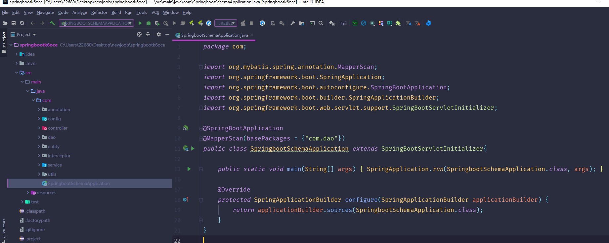

数据库表

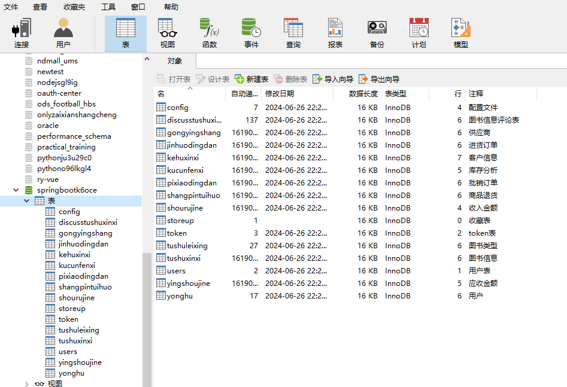

登录

前台首页

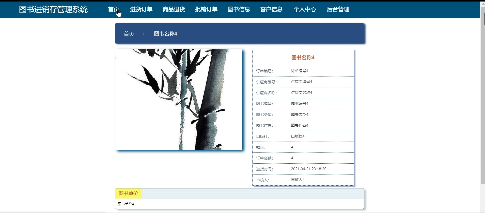

进货订单

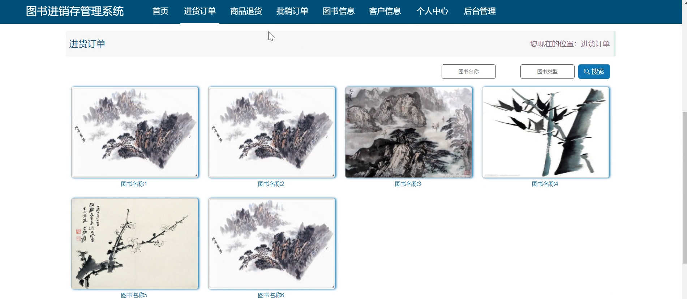

商品退货

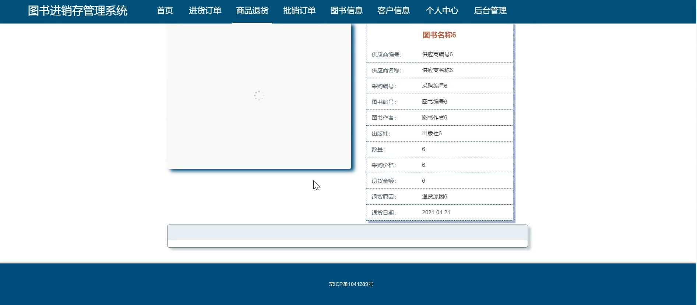

批销订单

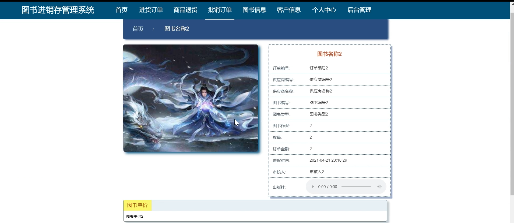

用户端后台管理

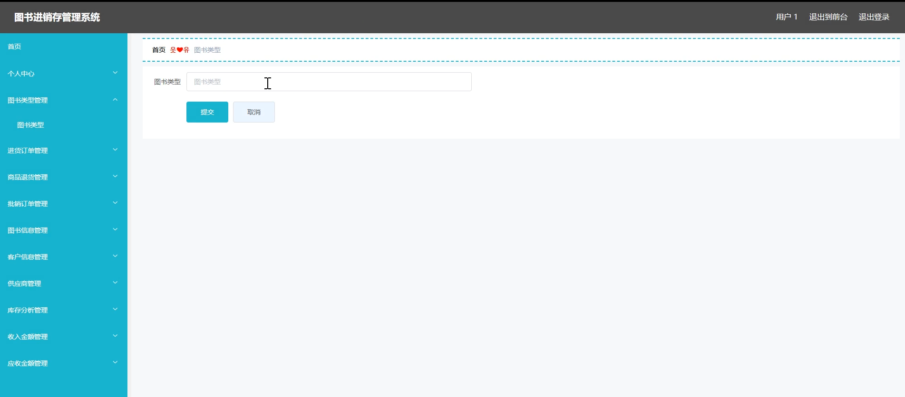

进货订单管理

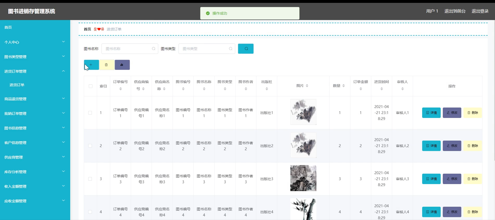

收入金额管理

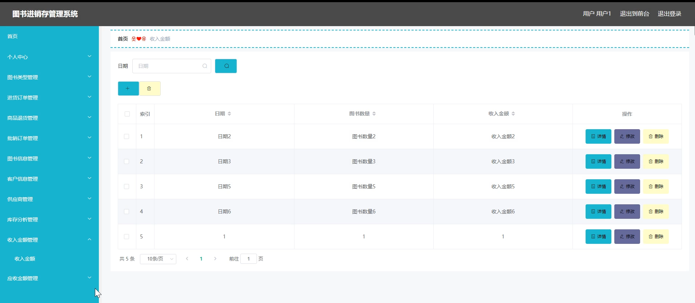

客户信息

管理员端用户管理

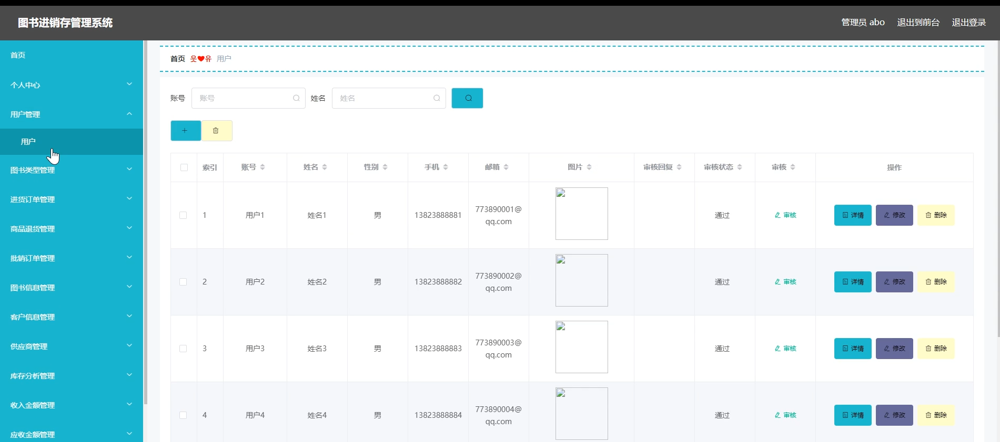

供应商管理

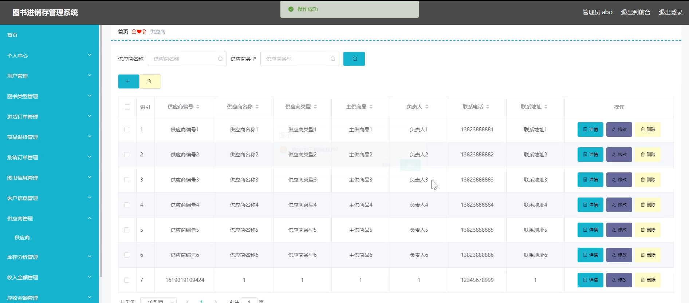

系统管理

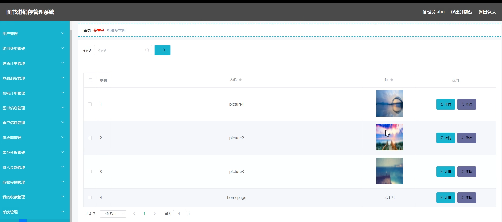

库存分析管理

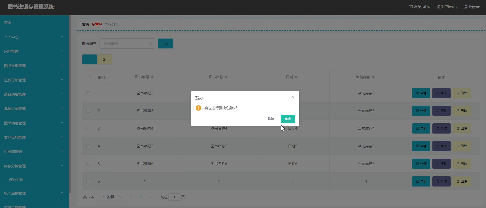

#### 总结

本基于 SpringBoot 的图书进销存管理系统通过全面而细致的功能设计，实现了对图书业务的全流程管理和优化。无论是管理员还是普通用户，都能在系统中找到满足其工作需求的功能模块。通过提高运营效率、优化库存管理、提升客户满意度、增强财务管理和促进决策支持，该系统为图书企业的发展提供了强大的助力，有助于企业在激烈的市场竞争中脱颖而出，实现可持续发展。

#### 使用说明

创建数据库，执行数据库脚本 修改jdbc数据库连接参数 下载安装maven依赖jar 启动idea中的springboot项目

后台地址：http://localhost:8080/springbootk6oce/admin/dist/index.html

管理员  abo 密码 abo

前台地址：http://localhost:8080/springbootk6oce/front/index.html
